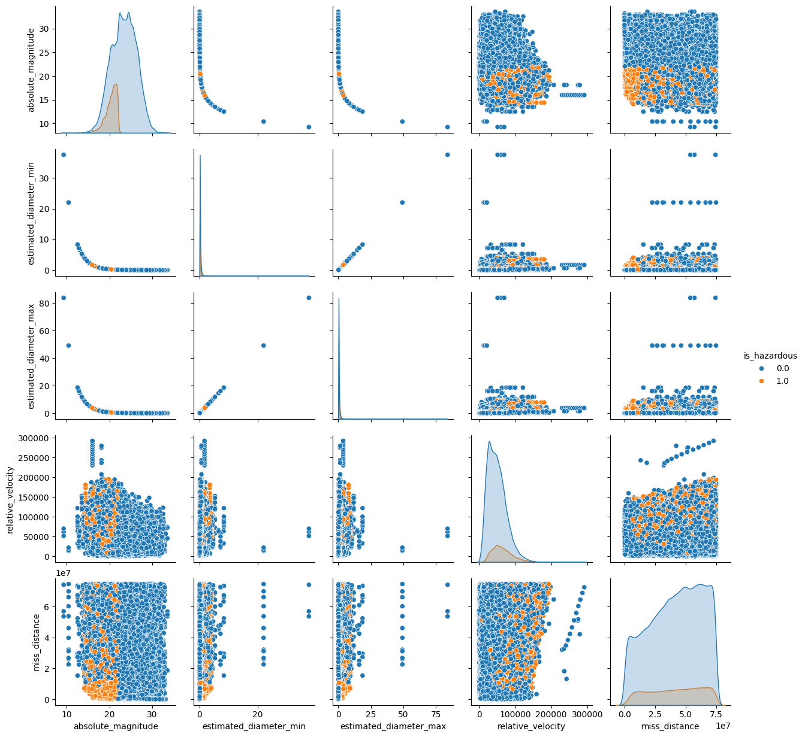
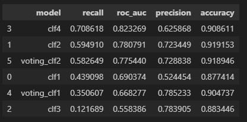

## The project
The goal of the project is to create a classifier with **high recall**, and pickle it in order to be ready for deployment.

The dataset was downloaded from Kaggle: https://www.kaggle.com/datasets/ivansher/nasa-nearest-earth-objects-1910-2024

We must build a predictive model able to detect hazardous asteroids, for its nature we are intereset in **recall** in other words we prefer false alarms instead to dont detect such dangerous asteroids.

## Models

We train using **GridSearchCV** severals models: **Kneboirghs** , **SVC** , **RandomForest**, **VotingClassifiers** 

Also we use **SMOTETomek** due to the imbalance of the data: **0.127 of the data are hazardous asteroid**, with a total data of 338166 rows.

## The best model

Our best model is **clf4** wich is **RandomForest** with 0.70 of recall and 0.82 of ROC_AUC

